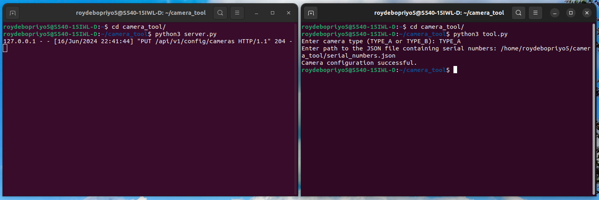

# Camera Commission tool
_Python-based command line tool that allows a user to commission the scanning cameras_

## Functions
- Prompts user for camera type and JSON file path.
- Loads serial numbers from the JSON file.
- Creates a camera configuration list based on provided data.
- Sends configuration to the API.
- Provides feedback on success or failure of the configuration process.

## Prerequisites
- Python 3.10.x
- `requests` library

## Installation

1. **Clone the repository:**

    ```sh
    git clone https://github.com/roydebopriyo5/camera-tool.git
    ```

2. **Install dependencies:**

    ```sh
    pip install requests
    ```

## Execute

1. **Start the test server:**

    ```sh
    cd camera_tool/
    python3 server.py
    ```

2. **Run the configuration tool:**

    ```sh
    python3 tool.py
    ```

    Following the prompts, enter camera type (`TYPE_A` or `TYPE_B`) and path to JSON file containing serial numbers (e.g., `serial_numbers.json`).

## Example screenshots

1. **Successfull configuration**


2. **Failed configuration**

    _If cameras have similar serial numbers_


    The tool gives error message in possible cases as follows:
    - JSON file provided is malformed or contains invalid syntax.
    - Configuration list does not contain all the required fields (ID, Serial, Type, Gain).
    - Gain value in JSON object is not a valid number.
    - Duplicate IDs in the JSON object.
    - Duplicate serial numbers in the JSON object.

## Running Tests

To run unit tests, use following command:

```sh
python3 -m unittest test_tool.py
```

Test functions for : User prompt, Loading of serial numbers, Creating camera configuration, and Response for successful and failed configuration.

_Success and fail scenerio_


